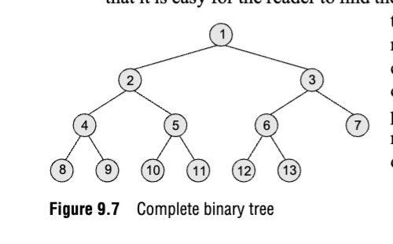

# Binary Tree Notes

## Definition

A tree is a hirearchical graph in which each node has at most two children, referred to as the left child and the right child. 

## Vocab

**Root node**: The topmost node.

**Leaf node**: A node with no children.

**Path**: A sequence of nodes and edges connecting a node with another node. On a tree, there is only one path between any two nodes.

**Ancestor node**: Any predecessor of a node on the path from root to that node.

**Descendant node**: Any successor of a node on the path from that node to a leaf.

**Level number**: Each child's level number is one more than its parent's level number. The root node is at level 0.

**Degree**: The number of children of a node. A leaf node has degree 0. In-degree and out-degree follow logically.

## General Trees

A general tree stores elements hirearchically. Each node can have an arbitrary number of children. We often lose a lot of performance benefit when using general trees because of the arbitrary amount of children. Because of that, we like to convert things to binary trees. Full conversion is not always possible.

## Forests

A forest is a disjoint set of trees. You can get a forest by deleting the root and the edges from the root to its children. You can also convert a forest to a tree by creating a new root and connecting it to the roots of the trees in the forest.

## Binary Trees

Binary trees are a special type of tree where each node has at most two children. 

A binary tree with only a root node has height 1. A binary tree of height h has at most $2^{h} - 1$ nodes, and at least h nodes.

Two binary trees are "similar" if they have the same structure, and are "copies" if they have the same structure and the same node values.

Two nodes are "siblings" if they have the same parent and have the same level number.

### Complete Binary Trees

A binary tree is complete if every level satisfies two properties:

1. Every level, except the possibly the last, is completely filled.
2. All nodes are as far left as possible.

### Extended Binary Trees

In an extended binary tree, every node has either 0 or 2 children. Nodes having two children are called internal nodes, and nodes having no children are called external nodes. We can convert any binary tree to an extended binary tree by adding external nodes as children of internal nodes that have only one child.

### Binary Trees in Memory

1. Linked: The simplest method. Each node has a pointer to its left child, a pointer to its right child, and a data value. Every tree has a pointer `ROOT`, and if `ROOT` is null, then the tree is empty.
2. Sequential: Uses a one-dimensional array. The simplest technique, but inefficient.
A one-dimensional array called `TREE` stores the tree elements:
- Root is stored at `TREE[1]`
- Children of node at location `K` are stored at `TREE[2*K]` (left) and `TREE[2*K+1]` (right)
- Maximum array size is `2^h - 1`, where `h` is the tree height
- `NULL` represents empty nodes or subtrees; `TREE[1] = NULL` means the tree is empty