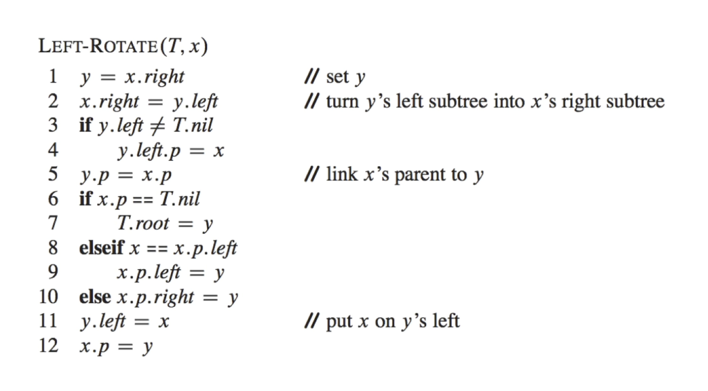

# Red-Black Tree

## Examples

## Internal Representation

In a red-black tree, no data is stored in the leaf nodes. The leaf nodes are just placeholders to make the tree complete. One bit is required for each node to indicate whether it is red or black. If you're smart, you can combine the bit with the data to save on memory.

## Rotations

A rotation alters the structure of the tree in order to decrease its height. Larger subtrees are moved up the tree, and smaller subtrees are moved down.

Rotations never change the order of the elements.

### Left Rotation

### Right Rotation

### Pseudo-code example

## Handling Deletions

## Code & Visualization

