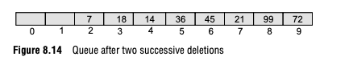

# The Circular Queue


A circular queue is functionally identical to a normal array-backed queue.
You can only push and pop items, and the oldest item in the queue is the first one out.

However, it solves a key problem with an array-backed queue.
If you have an array-backed queue of size 9, push 9 successive elements, then make two successive deletions, the queue now looks like this:



Every item is pushed back, up against the end of the array. So, when you go to push another element 
(which an array-backed queue does by adding a new element after the last valid one), you won't be able to.

A circular queue solves this by allowing the "front" and "back" indices to wrap around the array.
If "back" is all the way at the end of the array, it checks if there is empty space at the beginning,
and if so, moves "back" to the beginning of the array. It does the same with front when deleting elements.

## Implementation

* `front` and `back` both start at `-1` to indicate an uninitialized list*

* When an element is removed, `front` moves backward, towards the end of the array, wrapping around the array.
An insertion causes `back` to move backward, towards the end of the array, also wrapping around it.

* Removing an element returns the item at `front`, as with the linear queue.

```C
struct CircularQueue {
    int front;
    int back;
    char* arr;
    int size;
};

/* returns a response code. 1 for success 0 for error */
char cirqAdd(cirq, element) /* constraint: element cannot be 0 (null char) */
struct CircularQueue *cirq;
char element;
{
    if(element == 0){
        return 0;
    }
    if(cirq->back == -1 && cirq->front == -1){
        cirq->front = 0;
        cirq->back = 0;
        cirq->arr[0] = element;
        return 1;
    }else if(cirq->back == cirq->size-1){
        if(cirq->front == 0){
            return 0; /* overflow */
        }
        cirq->back = 0;
        cirq->arr[0] = element;
        return 1;
    }else if(cirq->back == cirq->front-1){
        return 0; /* overflow */
    }else{
        cirq->arr[++cirq->back] = element;
        return 1;
    }
}

/* returns the removed element, or char 0 if error (element cannot be 0; see cirqAdd) */
char cirqRemove(cirq)
struct CircularQueue *cirq;
{
    if(cirq->front == -1 && cirq->back == -1){
        return 0;
    }else if(cirq->back == cirq->front){ /* special case for only 1 element; reset the buffer*/
        char c;
        c = cirq->arr[cirq->back];
        cirq->back = -1;
        cirq->front = -1;
        return c;
    }else if(cirq->front == cirq->size - 1){
        cirq->front = 0;
        return cirq->arr[cirq->size - 1];
    }else{
        return cirq->arr[cirq->front++];
    }
}
```

