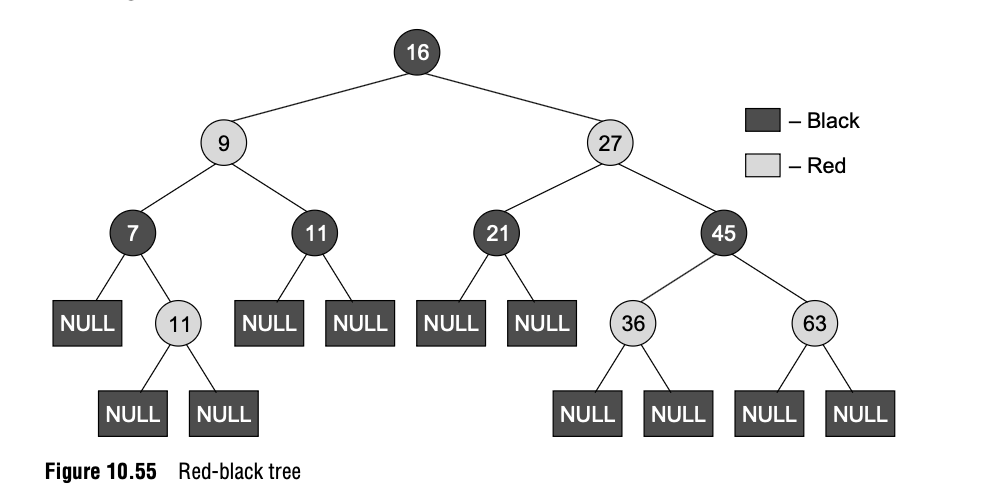
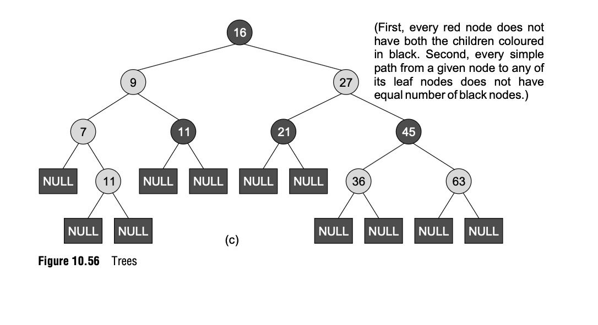
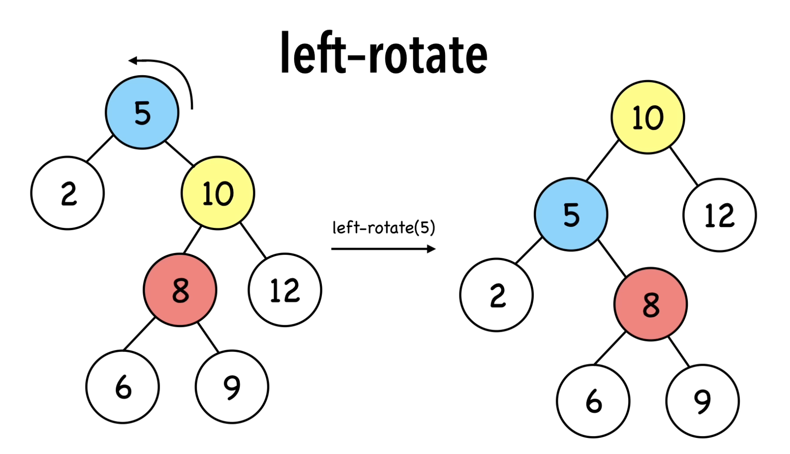
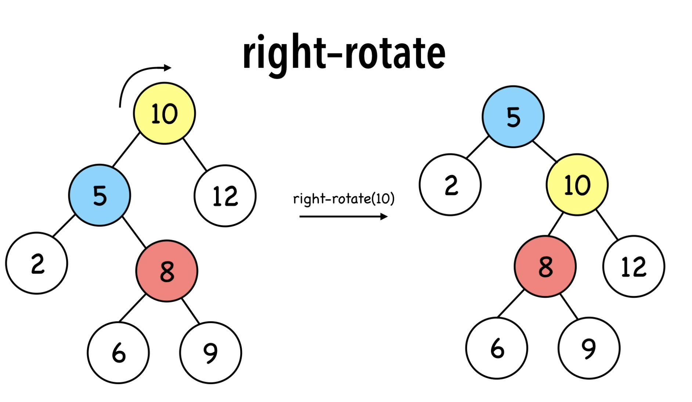

# Red-Black Tree

## Overview
-  Invented in 1972 by Rudolf Bayer who called it the ‘symmetric binary B-tree’
- Inserts and removes intelligently to keep the tree balanced and be efficient
- Leaf nodes contain no data
- Properties:
    1. Every node is either red or black
    2. The root node is always black
    3. All leaf nodes are black
    4. Every red node has both the children colored in black
    5. Every simple path from a given node to any of its leaf nodes has an equal number of black nodes
- Because of the constraints, the longest path from the root node to any leaf node is no more than twice as long as the shortest path from the root to any other leaf in the tree, ensuring a roughly balanced tree
    - Explanation: The shortest possible path will have all black nodes, and the longest possible path would alternately have a red and a black node. Since all maximal paths have the same number of black nodes (property 5), no path is more than twice as long as any other path

## Benefits and Applications
- Efficiency: operations (insertion, deletion, etc) are directly proportional to the height of the tree, so the balance allows red-black trees to be efficient in worst-case scenarios
- Run time: the worst-case running time for operations is $Olog(n)$
- Fast modifications: compared to stricter balancing trees like AVL trees, red-black trees require fewer rotations during insertions and deletions, making them faster for data that changes frequently
- Low memory overhead: 
    - AVL trees: need to store the height of the node or a balance factor that typically require 8-32 bits
    - Red-black trees: only need 1 bit to represent Red (0) or Black (1) (you can't always allocate exactly one bit, but this bit can be "hidden" inside of other data, such as the last bit of a pointer)
- Applications: 
    - Used to implement the std::map, std::multimap, std::set, and std::multiset containers in C++ STL.
    - Used to implement the TreeMap and TreeSet classes in Java's Collections Framework.
    - Used for indexing tables to enhance search and retrieval speeds in systems like MySQL and SQLite

## Examples

Red black tree:



Not a red black tree:



## Rotations

A rotation alters the structure of the tree in order to decrease its height. Larger subtrees are moved up the tree, and smaller subtrees are moved down.

Rotations never change the order of the elements.

### Left Rotation



### Right Rotation



### Pseudo-code example


## Insertion
- Insertion consists of two parts: the actual insertion and fixing the tree to ensure all properties are maintained

1. Find the correct leaf position and insert a new red node with two black leaf nodes (must be red so we don't change black-height and violate property 5)
2. Handle immediate exceptions: 
    - If the tree was empty, the new node is the root. Color it black, and insertion is complete
    - If the parent is black, no properties are violated, and insertion is complete
3. If the parent node is also red, you have a violation of property 4
    - Case 1: Uncle is red
        - Change the parent and uncle to black, change the grandparent to red
        - Move the pointer to the grandparent and repeat the check to make sure the grandparent doesn't conflict with its own parent
        - Keep performing recursively until it is fully solved and insertion is complete
    - Case 2: Uncle is black (or null), node is an inner child (right child of a left child or left child of a right child)
        - Rotate the parent to turn it into an outer child and proceed to Case 3
    - Case 3: Uncle is black (or null), node is an outer child (left child of a left child or right child of a right child)
        - Rotate the grandparent in the opposite direction. Then swap the colors of the original parent and the original grandparent
        - Rotate the grandparent in the opposite direction. Then recolor the original parent to black and the original grandparent to red
4. Ensure the root is black

## Deletion

First, you must delete the node as you do in a standard binary search tree. If the node is a leaf, you simply remove it. If the node has one child, you replace the node with its child. If it has two children, you replace the node's data with its in-order successor's data (the smallest node in the right subtree), and then **physically delete the in-order successor from its original position**.

**The "deleted node" always refers to the node physically removed from the tree** (either the original target if it has ≤ 1 child, or the in-order successor if the target has 2 children).

If the deleted node is red, then the tree is still a valid red-black tree.

If the deleted node is black, the tree likely now violates red-black properties. For example: 

- Deleting a black node may cause a path to have fewer black nodes than other paths, violating the property that all paths from a node to its descendant leaves must have the same number of black nodes.
- Deleting a black node that has a red child may cause two red nodes to be adjacent, violating the property that red nodes cannot have red children.

To fix these (rebalancing the tree), we evaluate different cases based on the properties of the deleted node's sibling. **The algorithm repeats recursively, moving up the tree until the black-height property is fully restored.**

1. **Sibling is red:** We recolor the sibling black, and its parent red, then rotate the parent away from the sibling (toward the deleted node's position). This converts the situation into case 2, 3, or 4. **After this rotation, the red sibling moves up and one of its children (the one that was closer to the deleted node's position) becomes the new node to check. Re-evaluate this node's properties against cases 2, 3, or 4.**

2. **Sibling is black with two black children:** Recolor sibling red, and if the parent is red, recolor it black. If the parent is black, the black deficiency moves up to the parent. **Repeat the entire case-matching process (cases 1-4) at the parent level** until the tree is fully rebalanced.

3. **Sibling is black, sibling's near child is red, sibling's far child is black:** Let DN = the deleted node position. The DN's "near child" is the child of the sibling that is closer to the deleted node position. The DN's "far child" is the child of the sibling that is farther from the deleted node position. 

```     
           P
       /      \
    DN        S
           /       \
       near (R)  far (B)
```

In this case, we recolor the near child black, and the sibling red, then rotate the sibling away from the deleted node position. **This transforms the situation into case 4. Apply case 4 next.**

4. **Sibling is black, sibling's far child is red:** Recolor the sibling to the parent's color, recolor the parent to black, recolor the far child to black, and rotate the parent away from the deleted node position (toward it). This restores the black-height property. **Rebalancing is complete.**

## Code & Visualization

I created an interactive visualization with Gemini CLI, using React, Tailwind CSS, Framer Motion, and TypeScript. Try it here: https://red-black-visualizer.pages.dev/